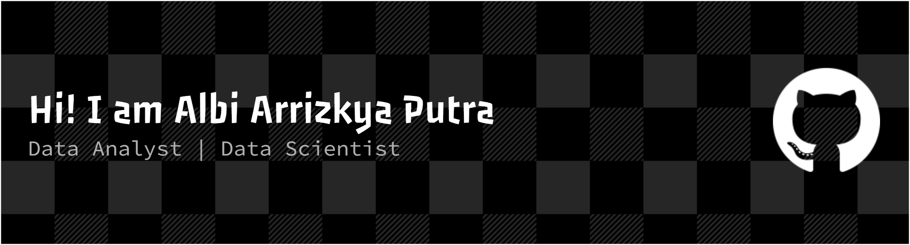

# My Portfolio

Selamat datang di repository saya!
Repository ini berisi kumpulan proyek yang saya kerjakan dalam bidang **Data Analytics** dan **Data Science**. Proyek di dalam repository mencakup proses pengolahan data, eksplorasi data, analisis, visualisasi, pembuatan model _machine learning_, serta penyusunan insight berdasarkan data.

### About Me
Saya Albi Arrizkya Putra, merupakan lulusan dari Program Studi Matematika Institut Teknologi Bandung. Saya memiliki ketertarikan pada pengolahan dan analisis data untuk membantu memahami suatu masalah dan menghasilkan informasi yang dapat digunakan dalam pengambilan keputusan. Beberapa aktivitas yang saya lakukan dalam proyek data meliputi:
* _Data cleaning_ dan _data preprocessing_
* _Exploratory Data Analysis_ (EDA)
* _Data visualization_
* _Statistical analysis_
* SQL _data analysis_
* _Dashboard development_
* _Feature engineering_
* _Machine learning_
* _Model evaluation_
* Interpretasi hasil analisis dan model
* Penyusunan laporan dan dokumentasi

### Skills
     

 

 

<!-- 

 -->

<!--  -->

<!-- ### Programming & Query
* Python
* SQL

### Data Analysis
* Pandas
* NumPy
* Exploratory Data Analysis
* Statistical Analysis
* Data Cleaning
* Data Preprocessing

### Data Visualization
* Matplotlib
* Seaborn
* Power BI
* Tableau

### Machine Learning
* Scikit-learn
* Supervised Learning
* Unsupervised Learning
* Classification
* Regression
* Clustering
* Model Evaluation
* Feature Engineering

### Tools
* Google Colab
* GitHub
* Microsoft Excel -->

## Career Interest
Saya terbuka terhadap kesempatan untuk bekerja pada posisi:
* Data Analyst
* Data Scientist
* Posisi lain yang berkaitan dengan analisis dan pengolahan data

### Connect with me!

